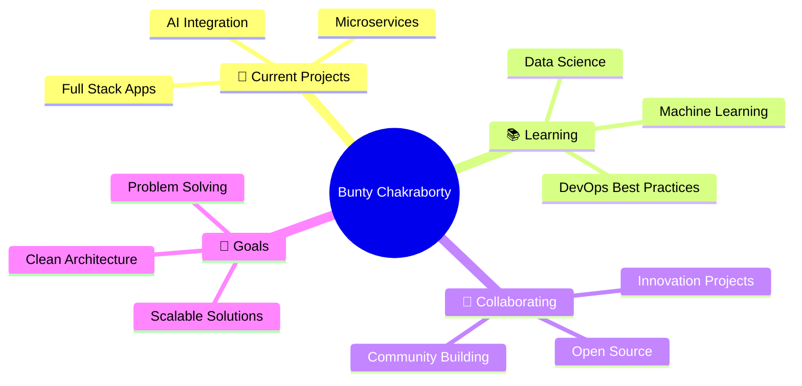

<div align="center">

# 🌟 Hello World! I'm **Bunty Chakraborty** 🌟
### 🚀 *Full Stack Alchemist* • *Code Architect* • *Innovation Catalyst* 🚀


---


</div>

## 🎯 **Current Mission**

<table>
<tr>
<td width="50%">

### 🔥 **Tech Stack Arsenal**
```javascript
const buntychakraborty = {
    backend: ['Java 8+', 'Spring Boot', 'Micronaut', 'gRPC'],
    frontend: ['React', 'React Native', 'Thymeleaf', 'OJET'],
    databases: ['MySQL', 'PostgreSQL', 'Oracle DB'],
    messaging: ['Apache Kafka', 'RabbitMQ'],
    cloud: ['AWS', 'Lambda', 'Docker', 'Kubernetes'],
    learning: ['Data Science', 'Machine Learning', 'DevOps'],
    passion: 'Solving impossible problems!'
};
```

</td>
<td width="50%">

### 🎪 **Fun Facts About Me**
- 🕵️ **Problem Solver**: Every bug is a mystery waiting to be solved!
- 🌱 **Growth Mindset**: Currently diving deep into ML & Data Science
- 🤝 **Team Player**: Always ready for open source collaborations
- ☕ **Coffee Driven**: Powered by caffeine and curiosity
- 🎯 **Goal**: Building scalable solutions that make a difference

</td>
</tr>
</table>

---

<div align="center">

## 💫 **Connect With Me**

[](https://www.linkedin.com/in/sss-b5a395119/)
[](mailto:sss@gmail.com)
[](https://www.hackerrank.com/sss)

*"Let's build something amazing together!"* ✨

</div>

---

## 🛠️ **Technology Ecosystem**

<div align="center">

### **Languages**


### **Frameworks & Libraries**


### **Databases & Messaging**


### **Cloud & DevOps**


### **AI/ML & Data Science**


### **Development Tools**


</div>

---

<div align="center">

## 📈 **GitHub Analytics**

<table>
<tr>
<td width="50%">

</td>
<td width="50%">

</td>
</tr>
</table>

### 🔥 **Streak Stats**


### 🏆 **Achievement Showcase**


</div>

---

<div align="center">

## 🎨 **GitHub Activity Graph**


</div>

---

<div align="center">

## 🎯 **What I'm Up To**



</div>

---

<div align="center">

## 💭 **Random Dev Quote**


</div>

---

<div align="center">

## 📊 **This Week I Spent My Time On**

<!--START_SECTION:waka-->
```text
Java         8 hrs 15 mins   ████████████░░░░░░░░░░░░░   45.2%
React        4 hrs 30 mins   ██████░░░░░░░░░░░░░░░░░░░   24.8%
Python       2 hrs 45 mins   ████░░░░░░░░░░░░░░░░░░░░░   15.1%
SQL          1 hr 30 mins    ██░░░░░░░░░░░░░░░░░░░░░░░   8.2%
DevOps       1 hr 15 mins    ██░░░░░░░░░░░░░░░░░░░░░░░   6.7%
```
<!--END_SECTION:waka-->

</div>

---


---

<div align="center">

### 👀 **Profile Views**


### 🌟 **If you like what you see, drop a ⭐ on my repositories!**


</div>

---

<div align="center">

*"Code is poetry written in logic"* 💻✨

**Let's connect and build the future together!** 🚀

</div>
