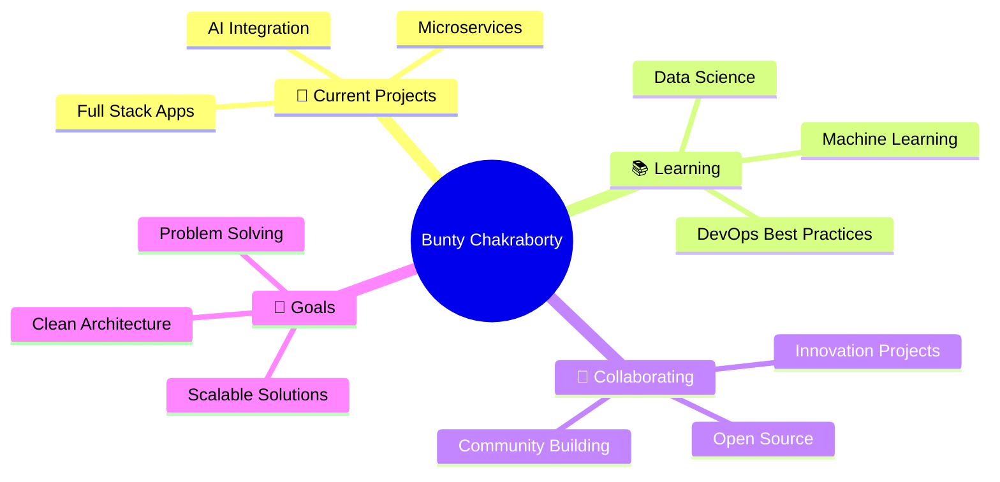

<!-- Header Banner -->
<p align="center">
  
</p>

<!-- Typing SVG Subtitle & Quick Stats -->
<div align="center">
  
  
  <p align="center">
    <a href="https://linkedin.com/in/bunty-chakraborty-b5a395119/" target="_blank">
      
    </a>
    <a href="mailto:buntychakraborty08@gmail.com">
      
    </a>
    <a href="https://www.hackerrank.com/bunty09_bunty09" target="_blank">
      
    </a>
  </p>
  
  <p align="center">
    
  </p>
</div>

---

## ⚡ Quick Overview

<table border="0">
  <tr>
    <td width="55%" valign="top">
      <h3>🔥 Tech Stack Arsenal</h3>
      
```javascript
const buntyChakraborty = {
  core: ["Java 8+", "Python", "JavaScript"],
  backend: ["Spring Boot", "Micronaut", "gRPC", "REST API"],
  frontend: ["React", "React Native", "Thymeleaf", "OJET"],
  dataStores: ["PostgreSQL", "MySQL", "Oracle DB"],
  messaging: ["Apache Kafka", "RabbitMQ"],
  devOps: ["Docker", "Kubernetes", "AWS", "OCI", "Jenkins"],
  aiMl: ["LangChain", "LangGraph", "Scikit-Learn"],
  philosophy: "Building elegant solutions for complex challenges"
};
```
    </td>
    <td width="45%" valign="top">
      <h3>🎪 Fun Facts About Me</h3>
      <ul>
        <li>🕵️‍♂️ <b>Problem Solver:</b> I treat every bug as an interesting mystery waiting to be solved.</li>
        <li>🌱 <b>Growth Mindset:</b> Currently diving deep into Machine Learning & Agentic AI workflows.</li>
        <li>🤝 <b>Team First:</b> Passionate about mentoring, clean design patterns, and open-source.</li>
        <li>☕ <b>Fuel:</b> Powered by caffeine, curiosity, and synthwave music.</li>
        <li>🎯 <b>Goal:</b> Creating high-scale architectures that solve real human needs.</li>
      </ul>
    </td>
  </tr>
</table>

---

## 🛠️ Technology Ecosystem

<details open>
<summary><b>💻 Languages & Core</b></summary>
<br/>
<p align="left">
  
  
  
  
  
</p>
</details>

<details open>
<summary><b>🚀 Frameworks & Libraries</b></summary>
<br/>
<p align="left">
  
  
  
  
  
  
  
  
</p>
</details>

<details open>
<summary><b>🤖 AI/ML & Data Science</b></summary>
<br/>
<p align="left">
  
  
  
  
  
  
  
  
</p>
</details>

<details open>
<summary><b>🗄️ Databases, Messaging & Queues</b></summary>
<br/>
<p align="left">
  
  
  
  
  
</p>
</details>

<details open>
<summary><b>☁️ Cloud, DevOps & Observability</b></summary>
<br/>
<p align="left">
  
  
  
  
  
  
  
  
  
  
  
</p>
</details>

<details open>
<summary><b>🛠️ Development Tools & IDEs</b></summary>
<br/>
<p align="left">
  
  
  
  
  
  
  
  
</p>
</details>

---

## 📈 Git & Work Analytics

<table border="0">
  <tr>
    <td width="50%" align="center">
      
    </td>
    <td width="50%" align="center">
      
    </td>
  </tr>
  <tr>
    <td colspan="2" align="center">
      <br/>
      
    </td>
  </tr>
</table>

### 🏆 Achievement Showcase

<p align="center">
  
</p>

### 🎨 Contribution Graph

<p align="center">
  
</p>

<!-- Snake animation below graph -->
<p align="center">
  
</p>

---

## 🎯 Current Strategy & Mindmap

<div align="center">


```mermaid
mindmap
  root((Bunty Chakraborty))
    🔧 Current Projects
      Full Stack Apps
      Microservices
      AI Integration
    📚 Learning
      Data Science
      Machine Learning
      DevOps Best Practices
    🤝 Collaborating
      Open Source
      Innovation Projects
      Community Building
    🎯 Goals
      Scalable Solutions
      Clean Architecture
      Problem Solving
```

</div>

---

## 📊 WakaTime Development Metrics

<div align="center">

<!--START_SECTION:waka-->
```text
Java         8 hrs 15 mins   ████████████░░░░░░░░░░░░░   45.2%
React        4 hrs 30 mins   ██████░░░░░░░░░░░░░░░░░░░   24.8%
Python       2 hrs 45 mins   ████░░░░░░░░░░░░░░░░░░░░░   15.1%
SQL          1 hr 30 mins    ██░░░░░░░░░░░░░░░░░░░░░░░   8.2%
DevOps       1 hr 15 mins    ██░░░░░░░░░░░░░░░░░░░░░░░   6.7%
```
<!--END_SECTION:waka-->

</div>

---

## 💭 Dev Wisdom

<p align="center">
  
</p>

---

<div align="center">

### 🌟 If you find my universe interesting, drop a ⭐ on my repositories!


*"Code is poetry written in logic"* 💻✨  
**Let's build the future together!** 🚀

</div>
