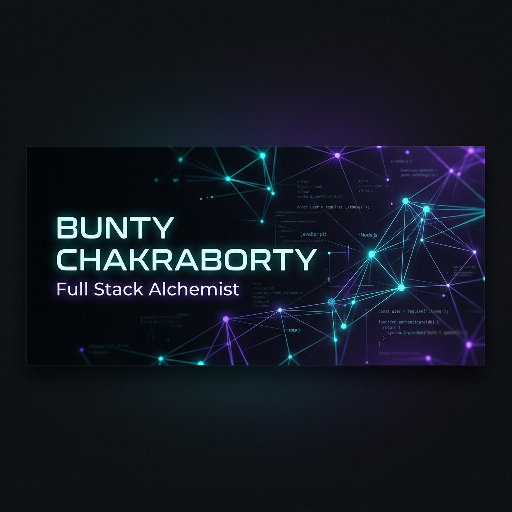
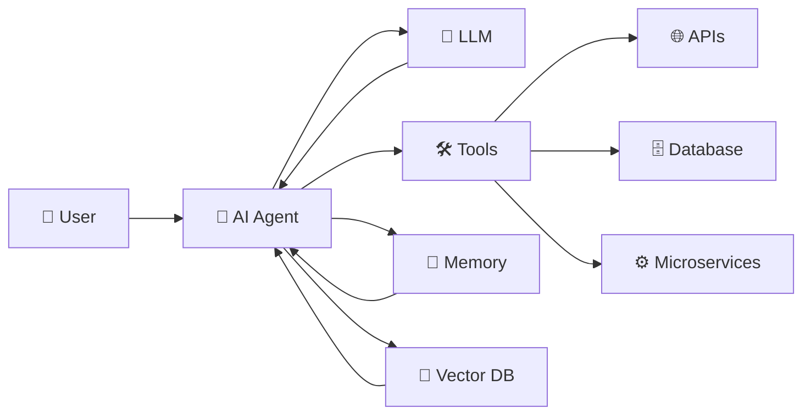
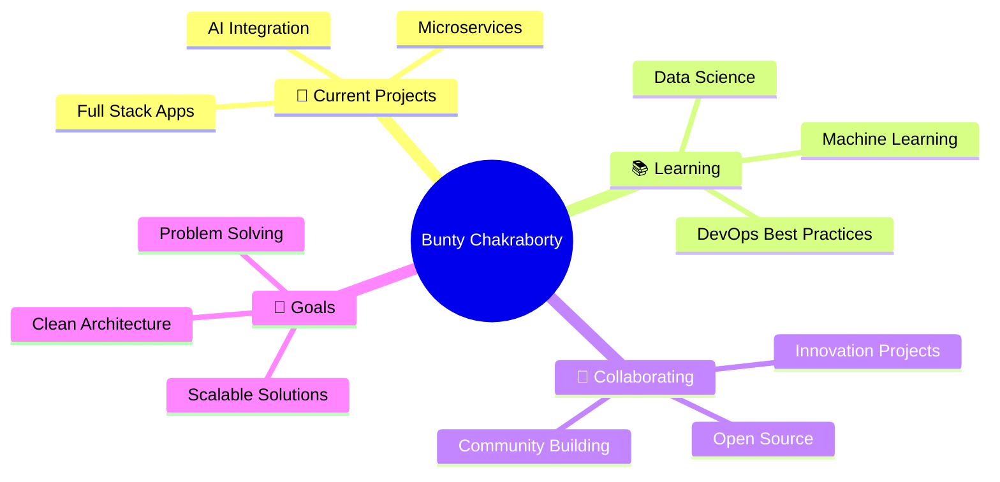

<!-- Header Banner -->
<p align="center">
  
</p>

<!-- Typing SVG Subtitle & Quick Stats -->
<div align="center">
  
  
  <p align="center">
    <a href="https://linkedin.com/in/bunty-chakraborty-b5a395119/" target="_blank">
      
    </a>
    <a href="mailto:buntychakraborty08@gmail.com">
      
    </a>
    <a href="https://www.hackerrank.com/bunty09_bunty09" target="_blank">
      
    </a>
  </p>
  
  <p align="center">
    
  </p>
</div>

---
<h2>⚡ Mainframe Terminal</h2>

<p align="center">
  
</p>

---

## 📡 System Status

<p align="center">
  
  
  
  
</p>

```text
╭──────────────────────────────────────────────────────────────╮
│                    SYSTEM DIAGNOSTICS                        │
├──────────────────────┬───────────────────────┬───────────────┤
│ MODULE               │ LOAD                  │ STATUS        │
├──────────────────────┼───────────────────────┼───────────────┤
│ Agentic AI Core      │ ████████████████████  │ ONLINE        │
│ Java Engine          │ ████████████████████  │ ACTIVE        │
│ Python Runtime       │ ████████████████░░░░  │ ACTIVE        │
│ Microservices        │ ███████████████████░  │ RUNNING       │
│ Cloud Infrastructure │ ██████████████████░░  │ CONNECTED     │
│ Curiosity Engine     │ ████████████████████  │ MAXIMUM       │
╰──────────────────────┴───────────────────────┴───────────────╯
```

---

## 🛰️ Current Mission

```yaml
current_status:
  building:
    - Scalable Microservices
    - Agentic AI Systems
    - AI-powered Applications

  exploring:
    - Multi-Agent Architectures
    - Machine Learning
    - Generative AI
    - Cloud Native Systems

  improving:
    - System Design
    - Distributed Systems
    - DevOps & Observability

  mission: "Turn complex problems into elegant, scalable solutions."
```

---

## 🧠 Agentic AI Architecture


```mermaid
flowchart LR
    U["👤 User"] --> A["🤖 AI Agent"]
    A --> L["🧠 LLM"]
    A --> T["🛠️ Tools"]
    A --> M["💾 Memory"]
    A --> V["🔎 Vector DB"]

    T --> API["🌐 APIs"]
    T --> DB["🗄️ Database"]
    T --> S["⚙️ Microservices"]

    L --> A
    M --> A
    V --> A
```

---

## 💻 `whoami`

<p align="center">
  
</p>

---

## 🚀 Runtime Environment

<p align="center">


</p>

---

## 🔐 Access Log

<p align="center">
  
</p>

---

## 🛠️ System Modules (Tech Stack)

<details open>
<summary><b>[MODULE_01] 💻 Languages & Core</b></summary>
<br/>
<p align="left">
  
  
  
  
  
</p>
</details>

<details open>
<summary><b>[MODULE_02] 🚀 Frameworks & Libraries</b></summary>
<br/>
<p align="left">
  
  
  
  
  
  
  
  
</p>
</details>

<details open>
<summary><b>[MODULE_03] 🤖 AI/ML & Data Science</b></summary>
<br/>
<p align="left">
  
  
  
  
  
  
  
  
</p>
</details>

<details open>
<summary><b>[MODULE_04] 🗄️ Databases, Messaging & Queues</b></summary>
<br/>
<p align="left">
  
  
  
  
  
</p>
</details>

<details open>
<summary><b>[MODULE_05] ☁️ Cloud, DevOps & Observability</b></summary>
<br/>
<p align="left">
  
  
  
  
  
  
  
  
  
  
  
</p>
</details>

<details open>
<summary><b>[MODULE_06] 🛠️ Tooling & Local Mainframe</b></summary>
<br/>
<p align="left">
  
  
  
  
  
  
  
  
</p>
</details>

---

## 📈 Git & Work Analytics

<p align="center">
  
</p>

<p align="center">
  
</p>

### 🏆 Achievement Showcase

<p align="center">
  
</p>

### 🎨 Contribution Graph

<p align="center">
  
</p>

<!-- Snake animation below graph -->
<p align="center">
  
</p>

---

## 🎯 System Strategy Mapping

<div align="center">


```mermaid
mindmap
  root((Bunty Chakraborty))
    🔧 Current Projects
      Full Stack Apps
      Microservices
      AI Integration
    📚 Learning
      Data Science
      Machine Learning
      DevOps Best Practices
    🤝 Collaborating
      Open Source
      Innovation Projects
      Community Building
    🎯 Goals
      Scalable Solutions
      Clean Architecture
      Problem Solving
```

</div>

---

## 📊 Development Metrics

<p align="center">
  
  
  
  
</p>

```text
╭─────────────────── DEVELOPER CONTROL CENTER ───────────────────╮
│                                                                │
│  CORE RUNTIME                                                  │
│                                                                │
│  ☕ Java          ████████████████████  PRIMARY   [ ONLINE ]   │
│  ⚛  React         █████████████████░░░  ACTIVE    [ ONLINE ]   │
│  🐍 Python        ████████████████░░░░  AI/ML     [ ONLINE ]   │
│  🗄  SQL           ███████████████░░░░░  DATA      [ ONLINE ]   │
│                                                                │
├────────────────────────────────────────────────────────────────┤
│                                                                │
│  CURRENT SYSTEM LOAD                                           │
│                                                                │
│  Backend Engineering      ████████████████████  100%           │
│  Microservices            ████████████████████  100%           │
│  Agentic AI               ██████████████████░░   90%           │
│  Cloud & DevOps           █████████████████░░░   85%           │
│  Machine Learning         ███████████████░░░░░   75%           │
│                                                                │
├────────────────────────────────────────────────────────────────┤
│                                                                │
│  ACTIVE PROCESS                                                │
│                                                                │
│  PID     PROCESS                STATUS                          │
│  001     agentic-ai-core        ● RUNNING                       │
│  002     microservice-engine    ● RUNNING                       │
│  003     curiosity.service      ● ALWAYS ON                     │
│  004     coffee.exe             ● CRITICAL                      │
│                                                                │
╰────────────────────────────────────────────────────────────────╯
```

<p align="center">
  <code>● SYSTEM ONLINE</code>
  &nbsp;&nbsp;•&nbsp;&nbsp;
  <code>BUILDING</code>
  &nbsp;&nbsp;•&nbsp;&nbsp;
  <code>LEARNING</code>
  &nbsp;&nbsp;•&nbsp;&nbsp;
  <code>SCALING</code>
</p>

---

## 💭 Decrypted System Wisdom (Quotes)

<p align="center">
  
</p>

---

<div align="center">

### 🌟 If you find my universe interesting, drop a ⭐ on my repositories!


*"Code is poetry written in logic"* 💻✨  
**Let's build the future together!** 🚀

</div>
